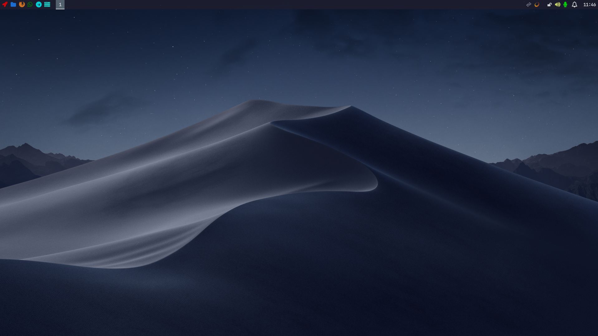
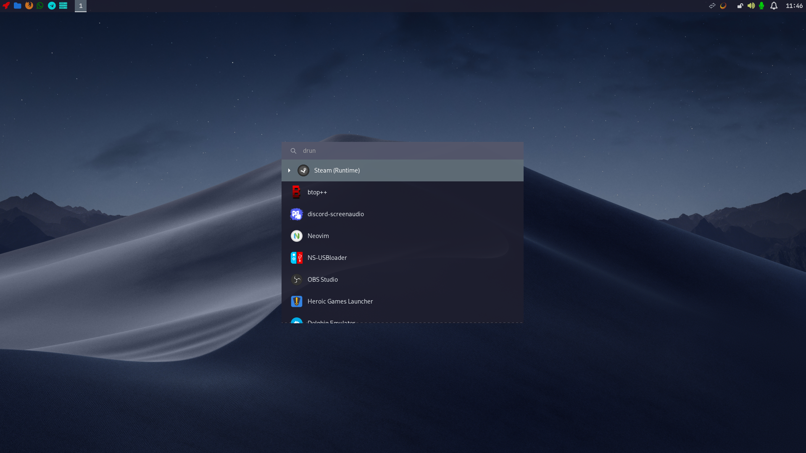
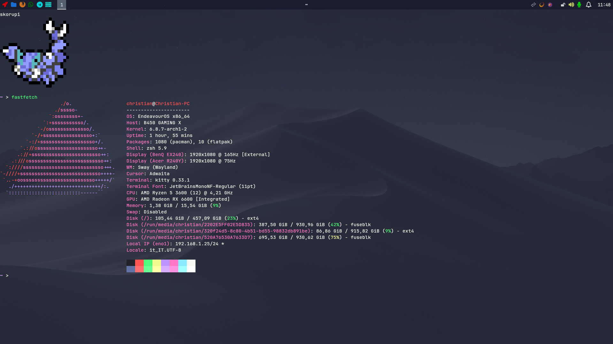
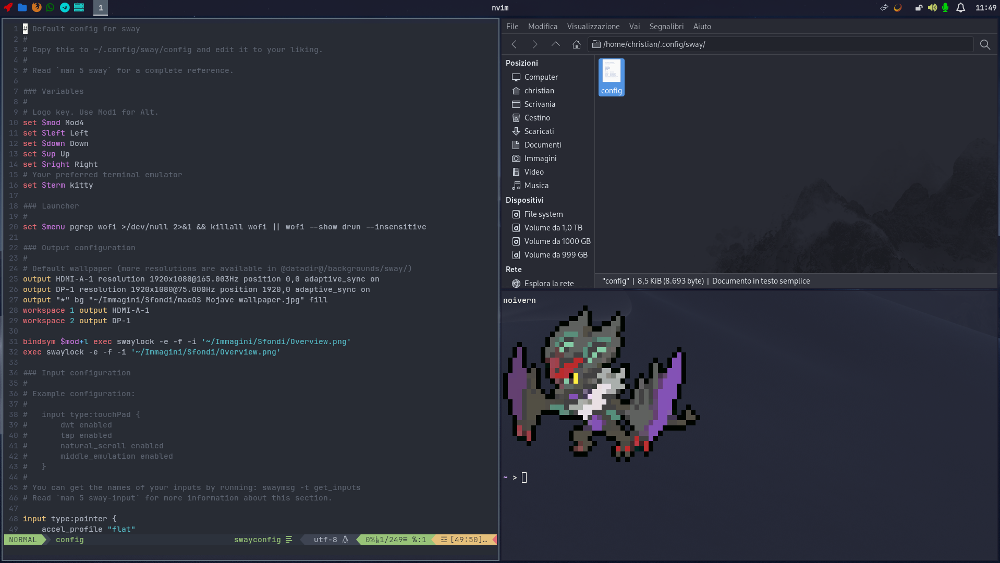

# sway_minimal_rice
A minimal Wayland rice focused for productivity

* Shell: Zsh
* WM: sway
* Launcher: wofi
* Terminal: kitty
* File manager: nemo
* Theme: Qogir-Dark
* Status bar: waybar
* Text editor: neovim
* Terminal: kitty
* Terminal theme: dracula (credit: https://draculatheme.com/kitty)
* Text editor: neovim with custom config (install vim-plug first)
